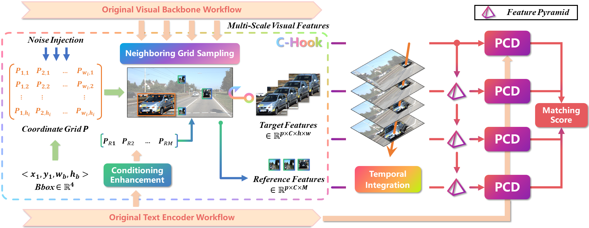

# Rethinking Two-Stage Referring-by-Tracking in Referring Multi-Object Tracking: Make it Strong Again

This repository contains code for paper:

Rethinking Two-Stage Referring-by-Tracking in Referring Multi-Object Tracking: Make it Strong Again

  

 

## Installation:

Besides Torch, the core components of FlexHook also include RoBERTa, ROPE Swin-T, and CLIP. Therefore, we recommend setting up the environment following the guidelines for <a href="https://github.com/naver-ai/rope-vit">ROPE-ViT</a> and installing the Transformers library to support the language model.

>Note: We use `PyTorch 2.6.0` and `CUDA 12.4` respectively. They are different from those in ROPE-ViT, but the configurations in ROPE-ViT are still applicable. 

1. Follow <a href="https://github.com/naver-ai/rope-vit">ROPE-ViT</a> to prepare environment

2. Prepare the dataset following [here](datasets/DATASET.md)

3. Prepare the pretrained following [here](pretrained/PRETRAIN.md)

4. Download the best weights and tracker results we provide in <a href="https://pan.baidu.com/s/1L-43y9SFDKmgl3dJNRlvNA?pwd=d3qj" title="model">FlexHook_best</a> and place them in the root directory as `FlexHook/SOTA_ckpts` and `FlexHook/tracker_outputs`.

5. Change the necessary items in the `configs` and batch size in `FlexHook/*.sh`.

## Inference and Training

We listed all training and testing commands in `FlexHook/*.sh`, which you’re free to use.

Simply comment out unrelated parts, then run sh xx.sh to execute. (For example: `sh infer.sh` to reproduce results mentioned in the paper)

The `-mix` suffix denotes LaMOT-related code. For inference on LaMOT, we run on subsets by default. 

To get full results on LaMOT, sequentially modify `cpmix.sh` and `eval.sh` to aggregate all videos and compute overall performance.

